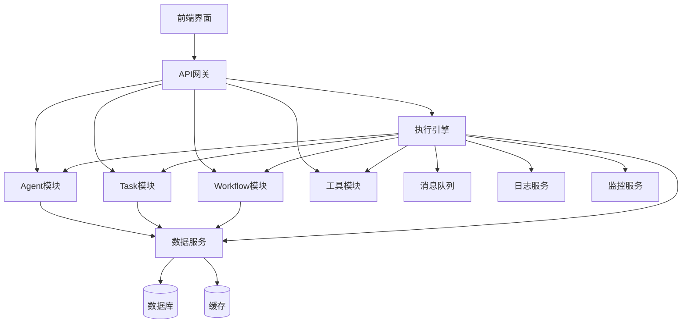

# CrewAI Studio 功能模块设计文档

## 📋 文档概述

本文档详细描述了 CrewAI Studio 项目的功能模块设计，包括各个模块的架构、接口、业务逻辑、数据流和交互关系。

---

## 🏗️ 模块架构概览

### 系统分层架构
```
┌─────────────────────────────────────────────────────────────┐
│                    前端展示层 (Frontend)                      │
├─────────────────────────────────────────────────────────────┤
│                    API 网关层 (API Gateway)                  │
├─────────────────────────────────────────────────────────────┤
│                    业务逻辑层 (Business Logic)               │
│  ┌─────────────┐ ┌─────────────┐ ┌─────────────┐ ┌─────────┐ │
│  │ Agent模块   │ │ Task模块    │ │ Workflow模块│ │ 执行引擎│ │
│  └─────────────┘ └─────────────┘ └─────────────┘ └─────────┘ │
├─────────────────────────────────────────────────────────────┤
│                    数据访问层 (Data Access)                  │
├─────────────────────────────────────────────────────────────┤
│                    数据存储层 (Data Storage)                 │
└─────────────────────────────────────────────────────────────┘
```

### 核心模块关系图


---

## 🤖 Agent 管理模块

### 模块概述
Agent 管理模块负责 AI 代理的生命周期管理，包括创建、配置、执行、监控和维护。

### 核心功能
1. **代理创建与配置**
2. **代理执行管理**
3. **代理状态监控**
4. **代理性能分析**
5. **代理版本控制**

### 模块架构
```
Agent模块
├── AgentController (控制器)
├── AgentService (业务逻辑)
├── AgentRepository (数据访问)
├── AgentExecutor (执行器)
├── AgentValidator (验证器)
└── AgentMonitor (监控器)
```

### 详细设计

#### 1. AgentController (控制器层)
```python
from fastapi import APIRouter, Depends, HTTPException
from typing import List, Optional

class AgentController:
    """Agent控制器 - 处理HTTP请求和响应"""
    
    def __init__(self, agent_service: AgentService):
        self.agent_service = agent_service
        self.router = APIRouter(prefix="/agents", tags=["agents"])
        self._setup_routes()
    
    def _setup_routes(self):
        """设置路由"""
        self.router.add_api_route("/", self.list_agents, methods=["GET"])
        self.router.add_api_route("/", self.create_agent, methods=["POST"])
        self.router.add_api_route("/{agent_id}", self.get_agent, methods=["GET"])
        self.router.add_api_route("/{agent_id}", self.update_agent, methods=["PUT"])
        self.router.add_api_route("/{agent_id}", self.delete_agent, methods=["DELETE"])
        self.router.add_api_route("/{agent_id}/execute", self.execute_agent, methods=["POST"])
        self.router.add_api_route("/{agent_id}/status", self.get_agent_status, methods=["GET"])
    
    async def list_agents(
        self,
        page: int = 1,
        page_size: int = 20,
        status: Optional[str] = None,
        search: Optional[str] = None,
        current_user: User = Depends(get_current_user)
    ) -> PaginatedResponse[AgentListItem]:
        """获取代理列表"""
        filters = AgentFilters(
            status=status,
            search=search,
            user_id=current_user.id
        )
        return await self.agent_service.list_agents(page, page_size, filters)
    
    async def create_agent(
        self,
        agent_data: AgentCreate,
        current_user: User = Depends(get_current_user)
    ) -> AgentResponse:
        """创建新代理"""
        return await self.agent_service.create_agent(agent_data, current_user)
    
    async def execute_agent(
        self,
        agent_id: str,
        execution_request: AgentExecuteRequest,
        current_user: User = Depends(get_current_user)
    ) -> ExecutionResponse:
        """执行代理"""
        return await self.agent_service.execute_agent(
            agent_id, execution_request, current_user
        )
```

#### 2. AgentService (业务逻辑层)
```python
from typing import List, Optional
from uuid import UUID

class AgentService:
    """Agent业务逻辑服务"""
    
    def __init__(
        self,
        agent_repository: AgentRepository,
        agent_executor: AgentExecutor,
        agent_validator: AgentValidator,
        execution_service: ExecutionService
    ):
        self.agent_repository = agent_repository
        self.agent_executor = agent_executor
        self.agent_validator = agent_validator
        self.execution_service = execution_service
    
    async def create_agent(
        self, 
        agent_data: AgentCreate, 
        user: User
    ) -> AgentResponse:
        """创建新代理
        
        Args:
            agent_data: 代理创建数据
            user: 当前用户
            
        Returns:
            AgentResponse: 创建的代理信息
            
        Raises:
            ValidationError: 数据验证失败
            PermissionError: 权限不足
        """
        # 1. 验证数据
        await self.agent_validator.validate_create_data(agent_data)
        
        # 2. 检查权限
        if not user.has_permission("agents:create"):
            raise PermissionError("Insufficient permissions to create agent")
        
        # 3. 检查名称唯一性
        existing_agent = await self.agent_repository.get_by_name(
            agent_data.name, user.id
        )
        if existing_agent:
            raise ConflictError(f"Agent with name '{agent_data.name}' already exists")
        
        # 4. 创建代理实体
        agent = Agent(
            name=agent_data.name,
            description=agent_data.description,
            role=agent_data.role,
            goal=agent_data.goal,
            backstory=agent_data.backstory,
            llm_config=agent_data.llm_config,
            tools=agent_data.tools,
            capabilities=agent_data.capabilities,
            created_by=user.id,
            status=AgentStatus.ACTIVE
        )
        
        # 5. 保存到数据库
        saved_agent = await self.agent_repository.create(agent)
        
        # 6. 初始化代理执行器
        await self.agent_executor.initialize_agent(saved_agent)
        
        # 7. 记录操作日志
        await self._log_agent_operation(
            "create", saved_agent.id, user.id, {"agent_name": agent_data.name}
        )
        
        return AgentResponse.from_entity(saved_agent)
    
    async def execute_agent(
        self,
        agent_id: str,
        execution_request: AgentExecuteRequest,
        user: User
    ) -> ExecutionResponse:
        """执行代理
        
        Args:
            agent_id: 代理ID
            execution_request: 执行请求
            user: 当前用户
            
        Returns:
            ExecutionResponse: 执行响应
        """
        # 1. 获取代理
        agent = await self.agent_repository.get_by_id(agent_id)
        if not agent:
            raise NotFoundError(f"Agent {agent_id} not found")
        
        # 2. 检查权限
        if not user.has_permission("agents:execute") or agent.created_by != user.id:
            raise PermissionError("Insufficient permissions to execute agent")
        
        # 3. 检查代理状态
        if agent.status != AgentStatus.ACTIVE:
            raise InvalidStateError(f"Agent {agent_id} is not active")
        
        # 4. 验证执行请求
        await self.agent_validator.validate_execution_request(execution_request)
        
        # 5. 创建执行记录
        execution = await self.execution_service.create_execution(
            execution_type=ExecutionType.AGENT,
            entity_id=agent_id,
            input_data=execution_request.input_data,
            context=execution_request.context,
            user_id=user.id,
            options=execution_request.options
        )
        
        # 6. 异步执行代理
        if execution_request.async_execution:
            await self.agent_executor.execute_async(
                agent, execution, execution_request
            )
        else:
            result = await self.agent_executor.execute_sync(
                agent, execution, execution_request
            )
            execution.output_data = result
            execution.status = ExecutionStatus.COMPLETED
            await self.execution_service.update_execution(execution)
        
        return ExecutionResponse.from_entity(execution)
    
    async def get_agent_performance(
        self, 
        agent_id: str, 
        time_range: TimeRange
    ) -> AgentPerformanceMetrics:
        """获取代理性能指标"""
        executions = await self.execution_service.get_agent_executions(
            agent_id, time_range
        )
        
        return AgentPerformanceMetrics(
            total_executions=len(executions),
            successful_executions=len([e for e in executions if e.status == ExecutionStatus.COMPLETED]),
            failed_executions=len([e for e in executions if e.status == ExecutionStatus.FAILED]),
            avg_execution_time=sum(e.execution_time for e in executions if e.execution_time) / len(executions),
            success_rate=len([e for e in executions if e.status == ExecutionStatus.COMPLETED]) / len(executions) if executions else 0
        )
```

#### 3. AgentExecutor (执行器)
```python
from crewai import Agent as CrewAIAgent, Task as CrewAITask
from typing import Dict, Any

class AgentExecutor:
    """Agent执行器 - 负责代理的实际执行"""
    
    def __init__(self, tool_manager: ToolManager):
        self.tool_manager = tool_manager
        self._agent_instances: Dict[str, CrewAIAgent] = {}
    
    async def initialize_agent(self, agent: Agent) -> None:
        """初始化代理实例
        
        Args:
            agent: 代理实体
        """
        # 1. 获取工具实例
        tools = await self.tool_manager.get_tools(agent.tools)
        
        # 2. 创建 CrewAI Agent 实例
        crewai_agent = CrewAIAgent(
            role=agent.role,
            goal=agent.goal,
            backstory=agent.backstory,
            tools=tools,
            llm=self._create_llm_instance(agent.llm_config),
            verbose=agent.verbose,
            allow_delegation=agent.allow_delegation,
            max_execution_time=agent.max_execution_time
        )
        
        # 3. 缓存代理实例
        self._agent_instances[agent.id] = crewai_agent
    
    async def execute_sync(
        self,
        agent: Agent,
        execution: Execution,
        request: AgentExecuteRequest
    ) -> Dict[str, Any]:
        """同步执行代理
        
        Args:
            agent: 代理实体
            execution: 执行记录
            request: 执行请求
            
        Returns:
            Dict[str, Any]: 执行结果
        """
        try:
            # 1. 获取代理实例
            crewai_agent = self._agent_instances.get(agent.id)
            if not crewai_agent:
                await self.initialize_agent(agent)
                crewai_agent = self._agent_instances[agent.id]
            
            # 2. 创建任务
            task = CrewAITask(
                description=request.task_description,
                agent=crewai_agent,
                context=request.context
            )
            
            # 3. 执行任务
            result = await crewai_agent.execute_task(task)
            
            # 4. 处理结果
            return {
                "result": result,
                "status": "completed",
                "execution_time": execution.execution_time,
                "agent_id": agent.id
            }
            
        except Exception as e:
            # 记录错误
            await self._log_execution_error(execution.id, str(e))
            raise ExecutionError(f"Agent execution failed: {str(e)}")
    
    async def execute_async(
        self,
        agent: Agent,
        execution: Execution,
        request: AgentExecuteRequest
    ) -> None:
        """异步执行代理
        
        Args:
            agent: 代理实体
            execution: 执行记录
            request: 执行请求
        """
        # 提交到后台任务队列
        await self._submit_background_task(
            self._execute_agent_background,
            agent, execution, request
        )
    
    def _create_llm_instance(self, llm_config: Dict[str, Any]):
        """创建LLM实例"""
        # 根据配置创建相应的LLM实例
        model_name = llm_config.get("model", "gpt-4")
        temperature = llm_config.get("temperature", 0.7)
        max_tokens = llm_config.get("max_tokens", 1000)
        
        # 这里可以根据不同的模型类型创建不同的LLM实例
        if model_name.startswith("gpt"):
            from langchain.llms import OpenAI
            return OpenAI(
                model_name=model_name,
                temperature=temperature,
                max_tokens=max_tokens
            )
        # 可以添加其他LLM提供商的支持
```

---

## 📋 Task 管理模块

### 模块概述
Task 管理模块负责任务的生命周期管理，包括任务创建、调度、执行、监控和结果处理。

### 核心功能
1. **任务创建与配置**
2. **任务依赖管理**
3. **任务调度执行**
4. **任务状态跟踪**
5. **任务结果处理**

### 模块架构
```
Task模块
├── TaskController (控制器)
├── TaskService (业务逻辑)
├── TaskRepository (数据访问)
├── TaskScheduler (调度器)
├── TaskExecutor (执行器)
└── DependencyManager (依赖管理)
```

### 详细设计

#### 1. TaskService (业务逻辑层)
```python
class TaskService:
    """Task业务逻辑服务"""
    
    def __init__(
        self,
        task_repository: TaskRepository,
        task_scheduler: TaskScheduler,
        dependency_manager: DependencyManager,
        agent_service: AgentService
    ):
        self.task_repository = task_repository
        self.task_scheduler = task_scheduler
        self.dependency_manager = dependency_manager
        self.agent_service = agent_service
    
    async def create_task(
        self, 
        task_data: TaskCreate, 
        user: User
    ) -> TaskResponse:
        """创建新任务
        
        Args:
            task_data: 任务创建数据
            user: 当前用户
            
        Returns:
            TaskResponse: 创建的任务信息
        """
        # 1. 验证任务数据
        await self._validate_task_data(task_data)
        
        # 2. 检查代理是否存在
        if task_data.assigned_agent_id:
            agent = await self.agent_service.get_agent(task_data.assigned_agent_id)
            if not agent:
                raise NotFoundError(f"Agent {task_data.assigned_agent_id} not found")
        
        # 3. 验证依赖关系
        if task_data.dependencies:
            await self.dependency_manager.validate_dependencies(
                task_data.dependencies
            )
        
        # 4. 创建任务实体
        task = Task(
            name=task_data.name,
            description=task_data.description,
            type=task_data.type,
            priority=task_data.priority,
            input_data=task_data.input_data,
            assigned_agent_id=task_data.assigned_agent_id,
            dependencies=task_data.dependencies,
            max_execution_time=task_data.max_execution_time,
            created_by=user.id,
            status=TaskStatus.PENDING
        )
        
        # 5. 保存任务
        saved_task = await self.task_repository.create(task)
        
        # 6. 创建依赖关系
        if task_data.dependencies:
            await self.dependency_manager.create_dependencies(
                saved_task.id, task_data.dependencies
            )
        
        # 7. 如果没有依赖，加入调度队列
        if not task_data.dependencies:
            await self.task_scheduler.schedule_task(saved_task)
        
        return TaskResponse.from_entity(saved_task)
    
    async def execute_task(
        self,
        task_id: str,
        execution_request: TaskExecuteRequest,
        user: User
    ) -> ExecutionResponse:
        """执行任务
        
        Args:
            task_id: 任务ID
            execution_request: 执行请求
            user: 当前用户
            
        Returns:
            ExecutionResponse: 执行响应
        """
        # 1. 获取任务
        task = await self.task_repository.get_by_id(task_id)
        if not task:
            raise NotFoundError(f"Task {task_id} not found")
        
        # 2. 检查任务状态
        if task.status not in [TaskStatus.PENDING, TaskStatus.PAUSED]:
            raise InvalidStateError(f"Task {task_id} cannot be executed in current state")
        
        # 3. 检查依赖是否满足
        dependencies_satisfied = await self.dependency_manager.check_dependencies(
            task_id
        )
        if not dependencies_satisfied:
            raise DependencyError(f"Task {task_id} dependencies not satisfied")
        
        # 4. 获取执行代理
        agent_id = execution_request.agent_override or task.assigned_agent_id
        if not agent_id:
            raise ValidationError("No agent assigned for task execution")
        
        # 5. 更新任务状态
        task.status = TaskStatus.RUNNING
        task.started_at = datetime.utcnow()
        await self.task_repository.update(task)
        
        # 6. 执行任务
        try:
            agent_execution_request = AgentExecuteRequest(
                task_description=task.description,
                input_data=task.input_data,
                context=execution_request.context,
                timeout=execution_request.timeout or task.max_execution_time,
                async_execution=execution_request.async_execution
            )
            
            execution_response = await self.agent_service.execute_agent(
                agent_id, agent_execution_request, user
            )
            
            # 7. 更新任务结果
            if not execution_request.async_execution:
                task.status = TaskStatus.COMPLETED
                task.completed_at = datetime.utcnow()
                task.output_data = execution_response.data.get("output_data", {})
                await self.task_repository.update(task)
                
                # 8. 检查并触发依赖任务
                await self._trigger_dependent_tasks(task_id)
            
            return execution_response
            
        except Exception as e:
            # 更新任务状态为失败
            task.status = TaskStatus.FAILED
            task.error_message = str(e)
            task.completed_at = datetime.utcnow()
            await self.task_repository.update(task)
            raise
    
    async def _trigger_dependent_tasks(self, completed_task_id: str) -> None:
        """触发依赖任务
        
        Args:
            completed_task_id: 已完成的任务ID
        """
        # 获取依赖于此任务的其他任务
        dependent_tasks = await self.dependency_manager.get_dependent_tasks(
            completed_task_id
        )
        
        for task in dependent_tasks:
            # 检查该任务的所有依赖是否都已完成
            all_dependencies_completed = await self.dependency_manager.check_dependencies(
                task.id
            )
            
            if all_dependencies_completed and task.status == TaskStatus.PENDING:
                # 将任务加入调度队列
                await self.task_scheduler.schedule_task(task)
```

#### 2. TaskScheduler (任务调度器)
```python
import asyncio
from typing import List, Dict
from queue import PriorityQueue

class TaskScheduler:
    """任务调度器 - 负责任务的调度和执行管理"""
    
    def __init__(
        self,
        task_executor: TaskExecutor,
        max_concurrent_tasks: int = 10
    ):
        self.task_executor = task_executor
        self.max_concurrent_tasks = max_concurrent_tasks
        self.task_queue = PriorityQueue()
        self.running_tasks: Dict[str, asyncio.Task] = {}
        self._scheduler_running = False
    
    async def start_scheduler(self) -> None:
        """启动调度器"""
        if self._scheduler_running:
            return
        
        self._scheduler_running = True
        asyncio.create_task(self._scheduler_loop())
    
    async def stop_scheduler(self) -> None:
        """停止调度器"""
        self._scheduler_running = False
        
        # 等待所有运行中的任务完成
        if self.running_tasks:
            await asyncio.gather(*self.running_tasks.values(), return_exceptions=True)
    
    async def schedule_task(self, task: Task) -> None:
        """调度任务
        
        Args:
            task: 要调度的任务
        """
        # 使用负优先级，因为PriorityQueue是最小堆
        priority = -task.priority
        self.task_queue.put((priority, task.created_at, task))
    
    async def _scheduler_loop(self) -> None:
        """调度器主循环"""
        while self._scheduler_running:
            try:
                # 检查是否有可用的执行槽位
                if len(self.running_tasks) >= self.max_concurrent_tasks:
                    await asyncio.sleep(1)
                    continue
                
                # 检查是否有待执行的任务
                if self.task_queue.empty():
                    await asyncio.sleep(1)
                    continue
                
                # 获取下一个任务
                _, _, task = self.task_queue.get()
                
                # 创建执行任务
                execution_task = asyncio.create_task(
                    self._execute_task_wrapper(task)
                )
                self.running_tasks[task.id] = execution_task
                
            except Exception as e:
                logger.error(f"Scheduler loop error: {e}")
                await asyncio.sleep(5)
    
    async def _execute_task_wrapper(self, task: Task) -> None:
        """任务执行包装器
        
        Args:
            task: 要执行的任务
        """
        try:
            await self.task_executor.execute_task(task)
        except Exception as e:
            logger.error(f"Task {task.id} execution failed: {e}")
        finally:
            # 从运行中任务列表移除
            self.running_tasks.pop(task.id, None)
```

---

## 🔄 Workflow 管理模块

### 模块概述
Workflow 管理模块负责工作流的设计、执行、监控和管理，支持复杂的业务流程编排。

### 核心功能
1. **工作流设计与配置**
2. **工作流执行引擎**
3. **步骤状态管理**
4. **条件分支处理**
5. **错误恢复机制**

### 模块架构
```
Workflow模块
├── WorkflowController (控制器)
├── WorkflowService (业务逻辑)
├── WorkflowRepository (数据访问)
├── WorkflowEngine (执行引擎)
├── StepExecutor (步骤执行器)
└── FlowValidator (流程验证器)
```

### 详细设计

#### 1. WorkflowEngine (工作流执行引擎)
```python
from typing import Dict, List, Any
from enum import Enum

class StepType(Enum):
    """步骤类型"""
    TASK = "task"
    AGENT = "agent"
    CONDITION = "condition"
    PARALLEL = "parallel"
    LOOP = "loop"
    WAIT = "wait"

class WorkflowEngine:
    """工作流执行引擎"""
    
    def __init__(
        self,
        task_service: TaskService,
        agent_service: AgentService,
        step_executor: StepExecutor
    ):
        self.task_service = task_service
        self.agent_service = agent_service
        self.step_executor = step_executor
    
    async def execute_workflow(
        self,
        workflow: Workflow,
        execution: Execution,
        input_data: Dict[str, Any]
    ) -> Dict[str, Any]:
        """执行工作流
        
        Args:
            workflow: 工作流实体
            execution: 执行记录
            input_data: 输入数据
            
        Returns:
            Dict[str, Any]: 执行结果
        """
        try:
            # 1. 初始化执行上下文
            context = WorkflowContext(
                workflow_id=workflow.id,
                execution_id=execution.id,
                input_data=input_data,
                variables={},
                current_step=0
            )
            
            # 2. 解析工作流定义
            workflow_definition = workflow.workflow_definition
            steps = workflow_definition.get("steps", [])
            
            # 3. 执行步骤
            for step_index, step_definition in enumerate(steps):
                context.current_step = step_index
                
                # 更新工作流状态
                workflow.current_step = step_index
                await self._update_workflow_status(workflow)
                
                # 执行步骤
                step_result = await self._execute_step(
                    step_definition, context
                )
                
                # 处理步骤结果
                if step_result.get("skip_remaining"):
                    break
                
                # 更新上下文
                context.variables.update(step_result.get("variables", {}))
            
            # 4. 完成工作流
            workflow.status = WorkflowStatus.COMPLETED
            workflow.current_step = len(steps)
            await self._update_workflow_status(workflow)
            
            return {
                "status": "completed",
                "output_data": context.variables,
                "steps_executed": context.current_step + 1
            }
            
        except Exception as e:
            # 处理执行错误
            workflow.status = WorkflowStatus.FAILED
            await self._update_workflow_status(workflow)
            
            # 根据错误处理策略决定是否重试
            if workflow.error_handling == "RETRY":
                return await self._retry_workflow(workflow, execution, input_data)
            
            raise WorkflowExecutionError(f"Workflow execution failed: {str(e)}")
    
    async def _execute_step(
        self,
        step_definition: Dict[str, Any],
        context: WorkflowContext
    ) -> Dict[str, Any]:
        """执行单个步骤
        
        Args:
            step_definition: 步骤定义
            context: 执行上下文
            
        Returns:
            Dict[str, Any]: 步骤执行结果
        """
        step_type = StepType(step_definition.get("type"))
        step_id = step_definition.get("id")
        
        logger.info(f"Executing step {step_id} of type {step_type}")
        
        try:
            if step_type == StepType.TASK:
                return await self._execute_task_step(step_definition, context)
            elif step_type == StepType.AGENT:
                return await self._execute_agent_step(step_definition, context)
            elif step_type == StepType.CONDITION:
                return await self._execute_condition_step(step_definition, context)
            elif step_type == StepType.PARALLEL:
                return await self._execute_parallel_step(step_definition, context)
            elif step_type == StepType.LOOP:
                return await self._execute_loop_step(step_definition, context)
            elif step_type == StepType.WAIT:
                return await self._execute_wait_step(step_definition, context)
            else:
                raise ValueError(f"Unknown step type: {step_type}")
                
        except Exception as e:
            logger.error(f"Step {step_id} execution failed: {e}")
            
            # 根据步骤配置决定是否继续
            if step_definition.get("continue_on_error", False):
                return {"status": "failed", "error": str(e)}
            else:
                raise
    
    async def _execute_task_step(
        self,
        step_definition: Dict[str, Any],
        context: WorkflowContext
    ) -> Dict[str, Any]:
        """执行任务步骤"""
        task_id = step_definition.get("task_id")
        if not task_id:
            raise ValueError("Task step requires task_id")
        
        # 准备执行请求
        execution_request = TaskExecuteRequest(
            context=context.variables,
            timeout=step_definition.get("timeout"),
            async_execution=False
        )
        
        # 执行任务
        result = await self.task_service.execute_task(
            task_id, execution_request, context.user
        )
        
        return {
            "status": "completed",
            "variables": result.data.get("output_data", {})
        }
    
    async def _execute_condition_step(
        self,
        step_definition: Dict[str, Any],
        context: WorkflowContext
    ) -> Dict[str, Any]:
        """执行条件步骤"""
        condition = step_definition.get("condition")
        if not condition:
            raise ValueError("Condition step requires condition")
        
        # 评估条件
        condition_result = await self._evaluate_condition(condition, context)
        
        if condition_result:
            # 执行 true 分支
            true_steps = step_definition.get("true_steps", [])
            for true_step in true_steps:
                await self._execute_step(true_step, context)
        else:
            # 执行 false 分支
            false_steps = step_definition.get("false_steps", [])
            for false_step in false_steps:
                await self._execute_step(false_step, context)
        
        return {"status": "completed", "condition_result": condition_result}
    
    async def _execute_parallel_step(
        self,
        step_definition: Dict[str, Any],
        context: WorkflowContext
    ) -> Dict[str, Any]:
        """执行并行步骤"""
        parallel_steps = step_definition.get("parallel_steps", [])
        if not parallel_steps:
            return {"status": "completed"}
        
        # 并行执行所有步骤
        tasks = []
        for parallel_step in parallel_steps:
            task = asyncio.create_task(
                self._execute_step(parallel_step, context.copy())
            )
            tasks.append(task)
        
        # 等待所有任务完成
        results = await asyncio.gather(*tasks, return_exceptions=True)
        
        # 处理结果
        successful_results = []
        failed_results = []
        
        for result in results:
            if isinstance(result, Exception):
                failed_results.append(str(result))
            else:
                successful_results.append(result)
        
        return {
            "status": "completed",
            "successful_count": len(successful_results),
            "failed_count": len(failed_results),
            "results": successful_results,
            "errors": failed_results
        }
```

---

## ⚙️ 执行引擎模块

### 模块概述
执行引擎模块是系统的核心执行组件，负责协调和管理所有类型的执行任务。

### 核心功能
1. **统一执行接口**
2. **执行状态管理**
3. **资源调度分配**
4. **执行监控告警**
5. **错误处理恢复**

### 模块架构
```
执行引擎模块
├── ExecutionController (控制器)
├── ExecutionService (业务逻辑)
├── ExecutionRepository (数据访问)
├── ResourceManager (资源管理)
├── MonitoringService (监控服务)
└── RecoveryManager (恢复管理)
```

### 详细设计

#### 1. ExecutionService (执行服务)
```python
class ExecutionService:
    """执行服务 - 统一的执行管理"""
    
    def __init__(
        self,
        execution_repository: ExecutionRepository,
        resource_manager: ResourceManager,
        monitoring_service: MonitoringService,
        recovery_manager: RecoveryManager
    ):
        self.execution_repository = execution_repository
        self.resource_manager = resource_manager
        self.monitoring_service = monitoring_service
        self.recovery_manager = recovery_manager
    
    async def create_execution(
        self,
        execution_type: ExecutionType,
        entity_id: str,
        input_data: Dict[str, Any],
        context: Dict[str, Any],
        user_id: str,
        options: ExecutionOptions = None
    ) -> Execution:
        """创建执行记录
        
        Args:
            execution_type: 执行类型
            entity_id: 实体ID（Agent/Task/Workflow）
            input_data: 输入数据
            context: 执行上下文
            user_id: 用户ID
            options: 执行选项
            
        Returns:
            Execution: 创建的执行记录
        """
        # 1. 检查资源可用性
        resource_available = await self.resource_manager.check_resource_availability(
            execution_type, options
        )
        if not resource_available:
            raise ResourceUnavailableError("Insufficient resources for execution")
        
        # 2. 创建执行记录
        execution = Execution(
            execution_type=execution_type,
            entity_id=entity_id,
            input_data=input_data,
            context=context,
            user_id=user_id,
            status=ExecutionStatus.PENDING,
            options=options or ExecutionOptions()
        )
        
        # 3. 保存执行记录
        saved_execution = await self.execution_repository.create(execution)
        
        # 4. 分配资源
        await self.resource_manager.allocate_resources(
            saved_execution.id, execution_type, options
        )
        
        # 5. 开始监控
        await self.monitoring_service.start_monitoring(saved_execution)
        
        return saved_execution
    
    async def start_execution(self, execution_id: str) -> None:
        """开始执行
        
        Args:
            execution_id: 执行ID
        """
        # 1. 获取执行记录
        execution = await self.execution_repository.get_by_id(execution_id)
        if not execution:
            raise NotFoundError(f"Execution {execution_id} not found")
        
        # 2. 检查执行状态
        if execution.status != ExecutionStatus.PENDING:
            raise InvalidStateError(f"Execution {execution_id} is not in pending state")
        
        # 3. 更新状态为运行中
        execution.status = ExecutionStatus.RUNNING
        execution.started_at = datetime.utcnow()
        await self.execution_repository.update(execution)
        
        # 4. 根据执行类型分发到相应的执行器
        try:
            if execution.execution_type == ExecutionType.AGENT:
                await self._execute_agent(execution)
            elif execution.execution_type == ExecutionType.TASK:
                await self._execute_task(execution)
            elif execution.execution_type == ExecutionType.WORKFLOW:
                await self._execute_workflow(execution)
            else:
                raise ValueError(f"Unknown execution type: {execution.execution_type}")
                
        except Exception as e:
            # 执行失败，更新状态
            await self._handle_execution_failure(execution, e)
    
    async def cancel_execution(self, execution_id: str, reason: str = None) -> None:
        """取消执行
        
        Args:
            execution_id: 执行ID
            reason: 取消原因
        """
        execution = await self.execution_repository.get_by_id(execution_id)
        if not execution:
            raise NotFoundError(f"Execution {execution_id} not found")
        
        if execution.status not in [ExecutionStatus.PENDING, ExecutionStatus.RUNNING]:
            raise InvalidStateError(f"Execution {execution_id} cannot be cancelled")
        
        # 更新状态
        execution.status = ExecutionStatus.CANCELLED
        execution.completed_at = datetime.utcnow()
        execution.error_message = reason or "Execution cancelled by user"
        await self.execution_repository.update(execution)
        
        # 释放资源
        await self.resource_manager.release_resources(execution_id)
        
        # 停止监控
        await self.monitoring_service.stop_monitoring(execution_id)
    
    async def get_execution_logs(
        self,
        execution_id: str,
        level: str = None,
        limit: int = 100
    ) -> List[ExecutionLog]:
        """获取执行日志
        
        Args:
            execution_id: 执行ID
            level: 日志级别过滤
            limit: 返回数量限制
            
        Returns:
            List[ExecutionLog]: 执行日志列表
        """
        return await self.execution_repository.get_execution_logs(
            execution_id, level, limit
        )
    
    async def _handle_execution_failure(
        self, 
        execution: Execution, 
        error: Exception
    ) -> None:
        """处理执行失败
        
        Args:
            execution: 执行记录
            error: 错误信息
        """
        # 1. 更新执行状态
        execution.status = ExecutionStatus.FAILED
        execution.completed_at = datetime.utcnow()
        execution.error_message = str(error)
        execution.error_details = {
            "error_type": type(error).__name__,
            "traceback": traceback.format_exc()
        }
        await self.execution_repository.update(execution)
        
        # 2. 释放资源
        await self.resource_manager.release_resources(execution.id)
        
        # 3. 检查是否需要重试
        if execution.options.auto_retry and execution.retry_count < execution.options.max_retries:
            await self.recovery_manager.schedule_retry(execution)
        
        # 4. 发送告警通知
        await self.monitoring_service.send_failure_alert(execution, error)
```

---

## 🛠️ 工具集成模块

### 模块概述
工具集成模块负责管理和提供各种外部工具和服务的集成，为 Agent 提供丰富的能力扩展。

### 核心功能
1. **工具注册管理**
2. **工具动态加载**
3. **工具执行代理**
4. **工具权限控制**
5. **工具性能监控**

### 模块架构
```
工具集成模块
├── ToolController (控制器)
├── ToolManager (工具管理)
├── ToolRegistry (工具注册)
├── ToolExecutor (工具执行)
├── ToolValidator (工具验证)
└── ToolMonitor (工具监控)
```

### 详细设计

#### 1. ToolManager (工具管理器)
```python
from typing import Dict, List, Any, Type
from abc import ABC, abstractmethod

class BaseTool(ABC):
    """工具基类"""
    
    def __init__(self, name: str, description: str, config: Dict[str, Any] = None):
        self.name = name
        self.description = description
        self.config = config or {}
    
    @abstractmethod
    async def execute(self, **kwargs) -> Any:
        """执行工具
        
        Args:
            **kwargs: 工具参数
            
        Returns:
            Any: 执行结果
        """
        pass
    
    @abstractmethod
    def get_schema(self) -> Dict[str, Any]:
        """获取工具参数模式
        
        Returns:
            Dict[str, Any]: 参数模式定义
        """
        pass
    
    def validate_parameters(self, parameters: Dict[str, Any]) -> bool:
        """验证参数
        
        Args:
            parameters: 输入参数
            
        Returns:
            bool: 验证结果
        """
        schema = self.get_schema()
        # 实现参数验证逻辑
        return True

class ToolManager:
    """工具管理器"""
    
    def __init__(self):
        self._tools: Dict[str, BaseTool] = {}
        self._tool_classes: Dict[str, Type[BaseTool]] = {}
        self._tool_configs: Dict[str, Dict[str, Any]] = {}
    
    def register_tool(
        self, 
        tool_class: Type[BaseTool], 
        config: Dict[str, Any] = None
    ) -> None:
        """注册工具类
        
        Args:
            tool_class: 工具类
            config: 工具配置
        """
        tool_name = tool_class.__name__.lower().replace('tool', '')
        self._tool_classes[tool_name] = tool_class
        self._tool_configs[tool_name] = config or {}
    
    async def get_tool(self, tool_name: str) -> BaseTool:
        """获取工具实例
        
        Args:
            tool_name: 工具名称
            
        Returns:
            BaseTool: 工具实例
        """
        if tool_name in self._tools:
            return self._tools[tool_name]
        
        if tool_name not in self._tool_classes:
            raise ToolNotFoundError(f"Tool {tool_name} not found")
        
        # 创建工具实例
        tool_class = self._tool_classes[tool_name]
        tool_config = self._tool_configs[tool_name]
        tool_instance = tool_class(
            name=tool_name,
            description=tool_class.__doc__ or "",
            config=tool_config
        )
        
        # 缓存工具实例
        self._tools[tool_name] = tool_instance
        return tool_instance
    
    async def get_tools(self, tool_names: List[str]) -> List[BaseTool]:
        """批量获取工具实例
        
        Args:
            tool_names: 工具名称列表
            
        Returns:
            List[BaseTool]: 工具实例列表
        """
        tools = []
        for tool_name in tool_names:
            tool = await self.get_tool(tool_name)
            tools.append(tool)
        return tools
    
    def list_available_tools(self) -> List[Dict[str, Any]]:
        """列出可用工具
        
        Returns:
            List[Dict[str, Any]]: 工具信息列表
        """
        tools_info = []
        for tool_name, tool_class in self._tool_classes.items():
            tools_info.append({
                "name": tool_name,
                "description": tool_class.__doc__ or "",
                "schema": tool_class().get_schema() if hasattr(tool_class, 'get_schema') else {}
            })
        return tools_info

# 具体工具实现示例
class SearchTool(BaseTool):
    """网络搜索工具"""
    
    async def execute(self, query: str, max_results: int = 10) -> Dict[str, Any]:
        """执行搜索
        
        Args:
            query: 搜索查询
            max_results: 最大结果数
            
        Returns:
            Dict[str, Any]: 搜索结果
        """
        # 实现搜索逻辑
        # 这里可以集成各种搜索API，如Google、Bing等
        search_results = await self._perform_search(query, max_results)
        
        return {
            "query": query,
            "results": search_results,
            "total_results": len(search_results)
        }
    
    def get_schema(self) -> Dict[str, Any]:
        """获取工具参数模式"""
        return {
            "type": "object",
            "properties": {
                "query": {
                    "type": "string",
                    "description": "Search query"
                },
                "max_results": {
                    "type": "integer",
                    "description": "Maximum number of results",
                    "default": 10,
                    "minimum": 1,
                    "maximum": 50
                }
            },
            "required": ["query"]
        }
    
    async def _perform_search(self, query: str, max_results: int) -> List[Dict[str, Any]]:
        """执行实际搜索"""
        # 这里实现具体的搜索逻辑
        # 可以使用 requests、aiohttp 等库调用搜索API
        pass

class CalculatorTool(BaseTool):
    """计算器工具"""
    
    async def execute(self, expression: str) -> Dict[str, Any]:
        """执行计算
        
        Args:
            expression: 数学表达式
            
        Returns:
            Dict[str, Any]: 计算结果
        """
        try:
            # 安全的表达式求值
            result = self._safe_eval(expression)
            return {
                "expression": expression,
                "result": result,
                "success": True
            }
        except Exception as e:
            return {
                "expression": expression,
                "error": str(e),
                "success": False
            }
    
    def get_schema(self) -> Dict[str, Any]:
        """获取工具参数模式"""
        return {
            "type": "object",
            "properties": {
                "expression": {
                    "type": "string",
                    "description": "Mathematical expression to evaluate"
                }
            },
            "required": ["expression"]
        }
    
    def _safe_eval(self, expression: str) -> float:
        """安全的表达式求值"""
        # 实现安全的数学表达式求值
        # 可以使用 ast.literal_eval 或其他安全的求值方法
        import ast
        import operator
        
        # 支持的操作符
        operators = {
            ast.Add: operator.add,
            ast.Sub: operator.sub,
            ast.Mult: operator.mul,
            ast.Div: operator.truediv,
            ast.Pow: operator.pow,
            ast.USub: operator.neg,
        }
        
        def eval_expr(node):
            if isinstance(node, ast.Num):
                return node.n
            elif isinstance(node, ast.BinOp):
                return operators[type(node.op)](eval_expr(node.left), eval_expr(node.right))
            elif isinstance(node, ast.UnaryOp):
                return operators[type(node.op)](eval_expr(node.operand))
            else:
                raise TypeError(f"Unsupported operation: {type(node)}")
        
        tree = ast.parse(expression, mode='eval')
        return eval_expr(tree.body)
```

---

## 📊 数据流和交互

### 模块间数据流


### 错误处理流程


---

## 📝 总结

本功能模块设计文档提供了 CrewAI Studio 项目的完整模块架构，包括：

1. **Agent 管理模块** - 完整的代理生命周期管理
2. **Task 管理模块** - 灵活的任务调度和依赖管理
3. **Workflow 管理模块** - 强大的工作流编排引擎
4. **执行引擎模块** - 统一的执行管理和监控
5. **工具集成模块** - 可扩展的工具生态系统

每个模块都采用了清晰的分层架构，具有：
- **高内聚低耦合** - 模块内部功能紧密相关，模块间依赖最小化
- **可扩展性** - 支持新功能和新工具的轻松集成
- **可测试性** - 每个组件都可以独立测试
- **可维护性** - 清晰的代码结构和完善的文档
- **高性能** - 异步处理和资源优化

该设计为 CrewAI Studio 的核心功能提供了坚实的架构基础，支持复杂的 AI 代理工作流管理需求。